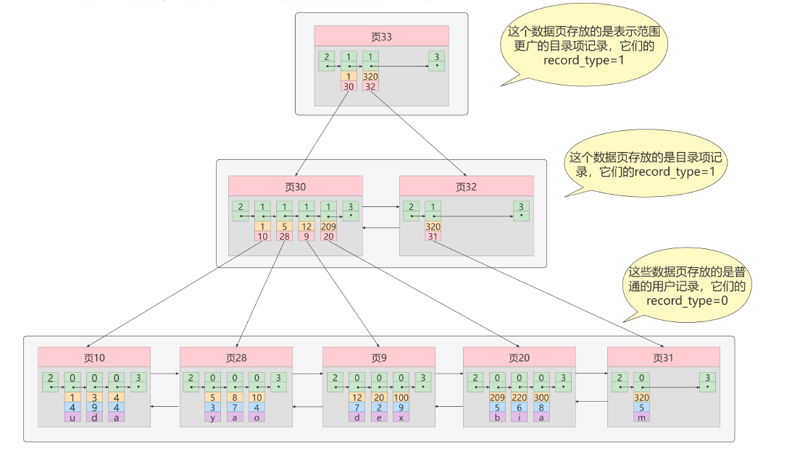
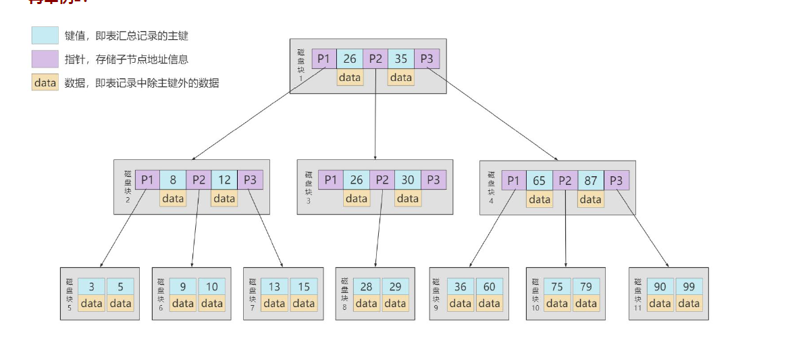

1.Innodb底层是如何形成一个B+树的
    根节点万年不动;
    真实的场景下,当用户向表中插入数据时,会将其记录在根节点中,当根节点空间已满但仍有数据插入进来时,根节点会将当前的所有记录
  复制到一个新分配页a中,然后对页a进行页分裂,得到一个新页b,新来的数据呢就根据键值来进入a或b页,此时的根节点则会变成一个记录
  目录项的页,以此类推;

2.索引的代价
    空间上的代价:每建立一个索引就需要为其建立一棵B+树,每一棵B+树的每一个节点都是一个数据页,一个页默认会占用16kb的存储空间,
               所以一个数据量很大的表,其索引就会占据很多空间
    时间上的代价:每次对表内数据进行增删改时,都需要去修改各个B+树索引,而有些时候修改索引值还会造成记录移位、页分裂、页面回收
               等操作以维护节点之间的关系,过多的索引会造成相关维护成本过高,性能反而降低

3.Innodb的自适应hash索引
    默认开启,我们可以通过innodb_adaptive_hash_index 变量来查看是否开启了自适应 Hash, 
    如:mysql> show variables like '%adaptive_hash_index';
    自适应哈希索引作用：MySQL Server为避免频繁回表,会使用频繁访问的二级索引项创建哈希索引
    InnoDB存储引擎会做如下优化：如果检测到某个二级索引不断被使用,二级索引成为热数据,那么InnoDB会根据在二级索引树上的索引值
  在构建一个哈希索引来加速搜索(只适用于等值比较)  
    主要是针对二级索引,通过构建一个hash,要比回表查的更快
    在mysql8.0中自适应hash索引默认开启

4.Hash本身的效率很高,那为什么索引时选择树形呢
   1) Hash索引仅能满足 等于 不等于 和 IN查询,如果进行范围查询,时间复杂度会退化为O(n),而树型结构依然可以保证O(log2(n))
      的时间复杂度
   2) Hash是无序的,所以如果有order by的情况,还需要对数据重新排序
   3) 无法处理联合索引的情况
   4) 对于[索引重复列过多]的情况,效率大大降低,因为相同值hash结果一致便会用链表来连接,这样在查找的时候就变成了遍历链表,效率
      就会大大降低

5.B+树和B树的区别
       
    1) B+树中非叶子结点存放索引,仅在叶子结点中存放数据,同层的各个结点之间才有双向链表进行连接,叶子结点内的数据采用单链表连接
       ,且从小到大排列; 而B树在所有节点上都可以存放数据且同层的各个结点之间没有链接
    2) B+树中非叶子结点中的键数=其叶子结点的个数;而B树中非叶子结点中的键数=其叶子结点的个数-1;之所以有这样的差异也是二者结构
       不同所致,B+树中非叶子结点存放的是每子结点的最小键值而B树中由于非叶子结点本身就有数据,所以叶子结点存放的都是非叶子结点
       数据两侧和之间的键值,所以才有上面的结论;
    3) B+树的查询效率更高;
       从数据上说:相同数据下因为B+树只有叶子结点存放数据,所以每个叶子结点可以容纳更多的键值,减少了树的高度;这样理解,B+树两层
                刚好能存放下的数据,B树就需要三层,因为第一层里存放了数据导致给第二层的索引树变少了,就不得不扩充第三层树;这里
                要知道虽然B树在第一层也多存了数据,但是数据占用的内存空间是远远大于索引的,第一层多存了一个数据就意味着下一层
                少了很多索引,如下面的例子
         数据总量:40kb   我们规定:一个数据占4kb,一个索引占1kb,一个数据页最多10kb,可以看到B+树仅需要两层结构即可而B树是三层
                    B+树                        B+树
                    1   1   1   1              1+4  1+4
                    10  10  10  6            1+4  1+4  1+4
                                           1+4  1+4  1+4
       从结构上说：B+树叶子结点之间有双向链表,叶子结点内的数据也有单链表由小到大连接;而B树如果要进行范围查找还需要通过中序遍历
                才能完成,所以在进行范围查找时效率要高很多

6.为了减少IO,索引树会一次性加载吗
    不会,一方面是因为在数据量较大时,索引本身占据的空间也就水涨船高,一次性加载索引树不但需要较长的时间,同时伴随着巨大的内存消耗;
  在B+树的实现中,通常采用按需加载,即当需要读取某一页时,才将该页从磁盘中加载到内存操作,而不是一次性将整个B+树的索引树加载进内存;
  索引树其实就是目录页,我们完全可以根据所要查找数据的值判断需要哪部分目录页,假设我们需要232,那只需要把230这个索引页加载即可,像
  3000这个索引页完全没必要啊,所以完全没必要一次性加载索引树

7.B+树的存储能力如何?为何说一般查找行记录,最多只需1-3次磁盘IO
    Innodb存储引擎中页的大小为16kb,一般的表的主键类型是INT(4个字节)或者BIGINT(8个字节),指针类型也一般为4或8个字节,也就是说
  一个页中大概存储16KB/8+8 = 1000个键,那么如果是一个三层的B+树大概可以存1000*1000*1000即10亿条记录,但实际情况中每个节点呢
  不一定填满,因此在数据库中,B+树的高度一般都在2-4层;而MYSQL中Innodb存储引擎在设计时是将根节点常驻内存的,所以我们在实际情况下,
  是不需要对根节点进行IO的,所以说在mysql中查找行记录一般只需要1-3次磁盘IO了;
    