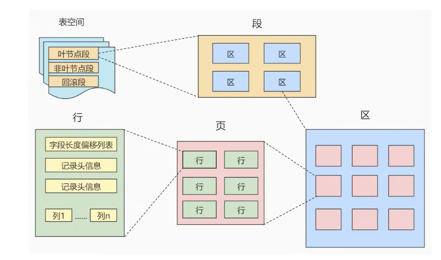

1.磁盘与内存交互的基本单位: 页
    InnoDB页中的大小默认为16KB
    以页作为磁盘和内存之间交互的基本单位,也就是一次最少从磁盘中读取16KB的内容到内存中,一次最少把内存中16KB的内容刷新到磁盘中;
  也就是说,[在数据库中,不论是读一行还是读多行,都是将这些行所在的页进行加载,所以数据库管理存储空间的基本单位是页,数据库I/O操作
  的最小单位也是页,而一个页中可以存储多个行数据];

2.页的上层结构
    在数据库中还存在着区、段、表空间等概念;行、页、区、段、表空间的关系如图：
    - 区是比页大一级的存在,Innodb引擎中,一个区会分配64个连续的页,因为Innodb中页的大小默认是16kb,所以一个区的大小是64*16KB=
    1MB
    - 段是由一个区或多个区组成,区是一个连续分配的空间(在Innodb中是连续的64个页,不过在段中不要求区与区之间是相邻的);
      [段是数据库中的分配单位,不同类型的数据库对象以不同的段形式存在];当我们创建数据表、索引时,就会创建相应的段,比如创建一张表时
    会创建一个表段,创建一个索引时会创建一个索引段;
      常见的三种段：数据段、索引段、回滚段,数据段顾名思义数据段负责存储和管理数据库对象的数据和元数据,索引段又分为叶子结点段和非叶子结点段,
    即叶子结点段中存放的都是存放叶子结点的区,即叶子结点段=存放所有叶子结点区的集合,非叶子结点段=存放所有非叶子结点区的集合,这样对于范围查找
    时效果就好多了,此外回滚段就是包含了多个区的事务相关数据的集合而不是所有数据的集合,数据库会在内存中保存更改的数据副本,同时在回滚段中创建
    相应的回滚段条目;当事务提交时,更改的数据将被写回到磁盘上的数据库文件中;如果事务回滚,那么数据库将通过回滚段条目中的信息来撤消已提交的更改
    并将数据恢复到之前的状态;
    - 表空间是一个逻辑容器,存储对象是段,在一个表空间中可以有一个或多个段,但是一个段只能属于一个表空间;数据库由一个或多个表空间组成,表空间从
    管理上可以划分为 系统表空间、用户表空间、撤销表空间、临时表空间等;
 