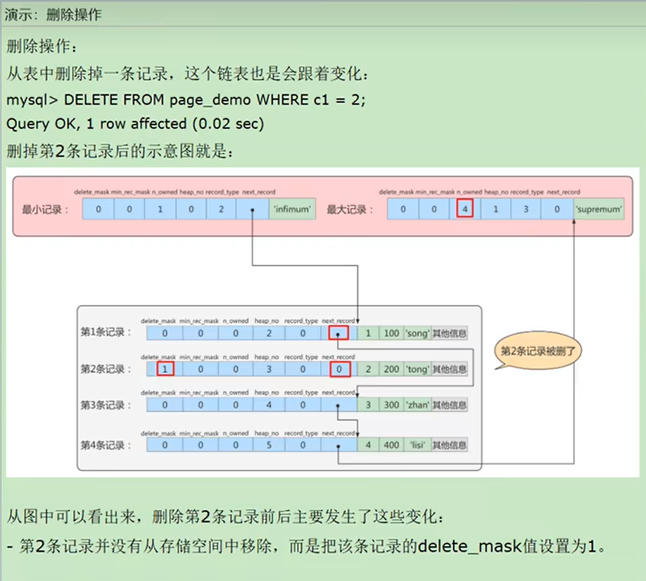
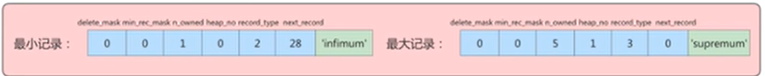

1.页的结构
    如果按类型分,常见的页有数据页(保存B+树节点)、系统页、Undo页和事务数据页;数据页是我们最常使用的页
    数据页的16KB的存储空间被划分为七个部分,分别是
    ① 文件头: 描述页的信息(比如页的编号,其上一页下一页都是谁等)
    ② 页头: 页的状态信息
    ③ 最大和最小记录: 两个虚拟的行记录
    ④ 用户记录: 存储行记录内容
    ⑤ 空闲记录: 页中还没有被使用的空间
    ⑥ 页目录: 存储用户记录的相对位置
    ⑦ 文件尾: 校验页是否完整

2.细说页的七个组成部分
    - 文件头和文件尾 ①&⑦
      ①文件头中又可以进行细分
        - FIL_PAGE_OFFSET 页号: 每一个页都有一个单独的页号,InnoDB通过页号可以唯一定位一个页
        - FIL_PAGE_TYPE 页类型: 表示页类型,像数据页、系统页Undo日志页等都是由该字段来进行控制的
        - FIL_PAGE_PREV和FIL_PAGE_NEXT 上一页和下一页: 表示当前页的上一页和下一页页号,基于此实现页之间的双向链表相连
        - FIL_PAGE_LSN 页面被最后修改时对应的日志序列位置(这个部分也是为了校验页的完整性,如果文件头尾的LSN值校验不成功,也可以说明同步过程出现了问题)
        - FIL_PAGE_SPACE_OR_CHKSUM 校验和: 首先搞清楚何为校验和————就是对于一个很长的字符串来说,我们会通过某种算法来计算一个比较短的值
      来代表这个很长的字符串,这个比较短的值就称为校验和,有了校验和,在进行两个较长字符串的比较之前就可以先比较校验和,这样就省去了直接比较两个长
      字符串的时间损耗;
        校验和不仅存在于文件头中,也存在于文件尾中;
        其作用在于:InnoDB存储引擎以页为单位把数据加载到内存中处理,如果该页的数据在内存中被修改了,那么再修改后的某个时间需要把数据同步到磁盘中,
      如果在同步的中间出现断电等意外情况导致同步中断,就会造成该页的数据传输不完整,而检测一个页的传输是否完整,就是通过比较文件头和文件尾的校验和,
      如果两个值不相等则证明页的传输有问题,需要重传,相等则认为页的传输已完成
        举例说明:当前磁盘中一个页,文件头和文件尾的校验和都是233,此时将该页数据加载到内存,此时内存中也有了这样一个页,文件头和文件尾的校验和也都
      是233,然后我们在内存中对数据进行了一些更改,然后现在想要把数据写回到磁盘中,写回之前呢会重新一次校验和,那么此时内存中该页的文件头尾校验和均
      发生改变,假设是999,接下来开始进行数据同步,如果进行到一半断电了,此时数据已经由上至下开始写入了,所以磁盘中该页的文件头的校验和会被更新为999,
      但由于数据同步没有完全完成,所以磁盘中该页的文件尾的校验和仍是233,一比对就会发现数据同步一定是出现了异常;
      ⑦文件尾中可以进行细分
        - FIL_PAGE_SPACE_OR_CHKSUM 校验和 
        - FIL_PAGE_LSN 页面被最后修改时对应的日志序列位置(这个部分也是为了校验页的完整性,如果文件头尾的LSN值校验不成功,也可以说明同步过程出现了问题)
　
    - 空闲记录、用户记录和最大最小记录 ③&④&⑤
      三者都属于记录部分,占据了页的主要空间
      ③空闲空间即尚未使用的存储空间
      用户记录中的记录是按照[指定的行格式]一条一条摆在用户记录之中,相互间形成单链表,想要清晰用户记录就需要知道记录行格式的[记录头信息]
        记录头信息(5字节)中又可以细分为以下几个主要部分
        - delete_mask 
            用于标记当前记录是否被删除;值为0:代表记录并没有被删除 值为1:代表记录被删除掉了
            Q:被删除的记录为什么还要在页中存储呢?
                你以为它删除了,可它还在真实的磁盘上,这些被删除的记录之所以不立即从磁盘中移除,是因为移除它们之后其他的记录在磁盘上需要重新排列,
              导致性能消耗;所以只是打了一个删除标记而已,所有被删除掉的记录都会组成一个所谓的垃圾链表,在这个链表中的记录占用的空间称为可重用空间,
              之后如果有新纪录插入到表中的话,可能把这些被删除的记录占用的存储空间覆盖掉
        - min_rec_mask
            B+树的每层非叶子结点中的最小记录都会添加该标记,min_rec_mask值为1,通过这个就可以快速跳过不满足条件的子树;
        - record_type
            表示当前记录的类型;0:普通记录 1:B+树非叶子节点记录 2:最小记录 3:最大记录
        - heap_no
            表示当前记录在本页中的位置
            Q:怎么不见heap_no值为0和1的记录？
                MYSQL会自动给每个页里加了两个记录,由于是MYSQL自动添加的,也称为伪记录或虚拟记录,这两个伪记录一个代表最小记录,一个代表最大记录;
              最小记录和最大记录的heap_no分别是0和1,也就是说他们的位置最靠前
        - n_owned
            页目录中每个组最后一条记录的头信息中会存储该组一共有多少条记录,作为n_owned字段,会在之后关于page directory的介绍中详解;
        - next_record
            表示从当前记录的真实数据到下一条记录的真实数据的地址偏移量
            比如:第一条记录的next_record值为32,意味着从第一条记录的真实数据的地址处向后找32个字节便是下一条记录的真实数据;注意,下一条记录
          指得并不是按照我们插入顺序的下一条记录,而是按照主键值由小到大的顺序的下一条记录
            此外有两个记录比较特殊即最小记录和最大记录,Infimum最小记录的next_record指向的就是当前页第一条记录(主键最小的记录), 当前页最后一条记录(主键最大的记录)的
          next_record指向的就是Supremum最大记录
            当数据页中存在多条被删除掉的记录时,这些记录的next_record属性将会把这些被删除掉的记录组成一个垃圾链表,以备之后重用这部分存储空间
        Q: 进行一个删除操作时,这些记录的记录头信息中的数据的相关变化
           如图所示,记录二被删除首先第二条记录自己的delete_mask变为1,此外自己的上一条记录的next_record将改为到自己的下一条记录的偏移量,上面的这两处改动在图中都可以
         明显的看到,还有一点需要注意的是最大记录的n_owned会减一,也很好理解,被删除了一条记录;
      ④用户记录
      ⑤最小最大记录
      InnoDB规定的最小记录与最大记录这两条记录的构造十分简单,都是由5个字节大小的记录头信息和8个字节大小的固定部分组成
      其中记录头信息呢也只有最小记录和最大记录那两个记录头信息即record_type为2和3、heap_no为0和1的那两条记录的记录头信息