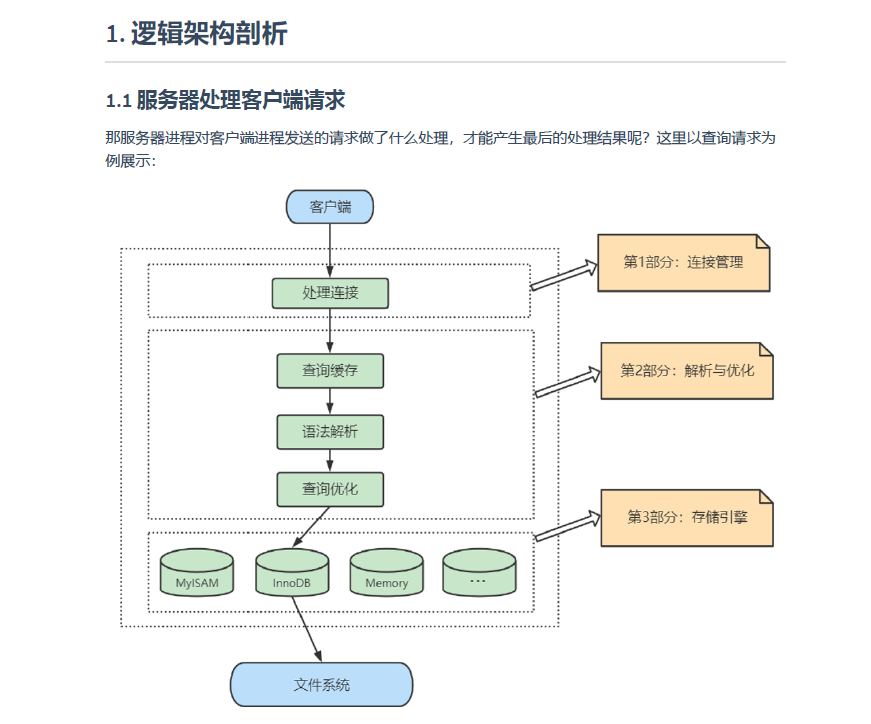

Mysql是典型的C/S架构即Client/Server架构,按照逻辑架构进行划分,主要可以分成三个部分
    - 连接层   客户端与服务端的连接,比较直白的就是用户的登录以及一些权限的校验
    - 服务层   查询缓存 语法解析 查询优化 
    - 引擎层   调用相关物理引擎对磁盘上的文件进行查找
.png)是更为详细的mysql逻辑架构图
运行逻辑如下:
    Connectors -> Connection Pool -> SQL Interface -> Caches&Buffers -> Parser -> 
    Optimizer -> Engines -> File system -> Caches&Buffers -> SQL interface
简单解释一下就是:
    远程客户端连接到我们的mysql,建立了连接后通过sql接口获取到要执行的sql语句,先去缓存中看一下是否有相同的,如果有直接返回结果,
没有的话进入解析器,检查sql语法,生成语法树,进入优化器,选用合适索引,调用引擎开始与文件系统交互在磁盘上进行数据查找,将结果数据写入
缓存中,最后把结果通过sql接口返回;

那么结合我们简单架构和复杂结构来看呢,连接层对应的就是我们的连接池,服务层对应的就是sql接口、解析器、优化器和查询缓存,
引擎层对应的就是我们的存储引擎,而我们的文件系统和日志则是存储层

一个思考问题:
    一个系统只会跟Mysql建立一个连接吗?只能有一个系统和Mysql建立连接吗?
    答:一个系统可以跟Mysql建立多个连接,并且Mysql也可以与多个系统建立连接,那么为了解决TCP无限创建与TCP销毁所带来的资源消耗,
       Mysql服务器有专门的TCP连接池限制连接数,采用长链接复用TCP连接,来解决上述问题
       并且每一个TCP连接建立后,必须要分配一个线程来与该客户端进行交互,所以Mysql服务器还会有一个线程池,去负责处理后续的交互