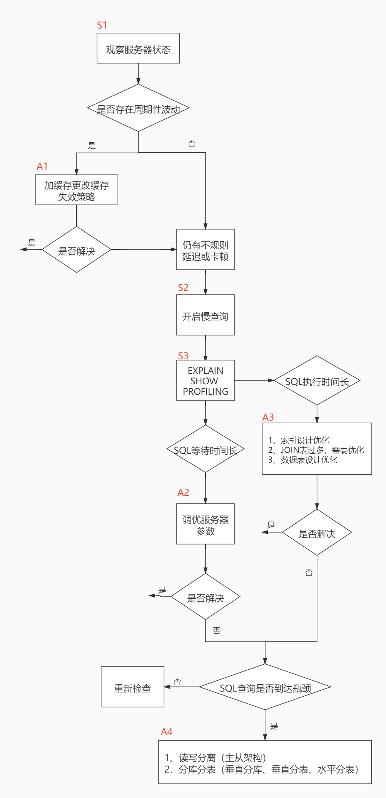

1.慢查询日志
    MYSQL的慢查询日志用于记录在MYSQL中响应时间超过阈值的语句,具体指运行时间超过long_query_time值的SQL,会被记录到慢查询日志中,
  long_query_time的默认值为10,意思是运行10秒以上(不包含10秒)的语句,认为是超出了我们可以忍耐的最大时间值  
    它可以帮助我们发现那些执行时间特别长的SQL查询,当我们的数据库服务器发生阻塞,运行变慢时,可以看一下慢查询日志,收集执行时间较长的
  SQL查询,再结合EXPLAIN进行全面分析
    默认情况下,MYSQL数据库没有开启慢查询日志,需要我们手动来设置这个参数,[如果不是调优需要,一般不建议启动该参数,因为开启慢查询日志
  会或多或少带来一定的性能影响]

2.开启慢查询参数
    mysql> show variables like '%slow_query_log%';   查看慢查询参数状态
    mysql> set global slow_query_log = on;  开启
    mysql> show variables like '%slow_query_log%';   此时在查询相关参数,就可以发现会多一个慢查询文件log的信息
　
    mysql> show global variables like '%long_query_time%';    查看全局慢查询时间阈值,默认10s
    mysql> set global long_query_time = 1;  设置全局时间阈值设置为1s
    mysql> show variables like '%long_query_time%';   默认是当前session的时间阈值
    mysql> set long_query_time = 1;  设置当前session的时间阈值设置为1s
    为什么实操的时候可能要global设置一遍,session再设置一遍?
      如果只修改了global层面的变量,那么只有新的客户端连接到服务器时才会使用这个新值,而已存在的连接会使用旧值;所以对session层面的
    修改是为了可以改变当前运行session的变量信息,而为了避免以后每建立一次连接都要重新设置,所以在global也对变量进行修改;那如果只需要
    在当前的会话中进行变量修改,就不需要去修改global层面的变量了;
      但是需要注意,通过set方式修改慢查询日志状态,都属于临时修改,一旦MYSQL服务器重启,重启后的MYSQL的慢查询日志去读取配置文件仍然是OFF的;
    不过一般使用当次连接的临时性开启就蛮好,如果要永久开启慢查询日志,就需要修改配置文件了;my.cnf或者my.ini文件,
    把mysqlId组下的slow_query_log值设为OFF,修改保存后,再重启MYSQL服务,即可生效;　
    mysql>show global status like '%Slow_queries%'; 查看当前系统中慢查询条数

3.慢查询日志分析工具———— mysqldumpslow
    在服务器上使用;
    mysqldumpslow还有一些参数
      -a:不将数字抽象成N,字符串抽象成S
      -s:是表示按何种方式排序
        c:访问次数
        l:锁定时间
        r:返回记录
        t:查询时间
        al:平均锁定时间
        ar:平均返回记录数
        at:平均查询时间(默认方式)
        ac:平均查询次数
      -t:即为返回前面多少条的数据
      -g:后边搭配一个正则表达式,大小写不敏感
    实操:
        在我本地自己的两台虚拟机上,默认情况数据库慢查询的日志文件在/var/lib/mysql下的**slow.log文件,我们使用mysqldumplslow进行
      慢查询分析也是针对这个日志文件进行分析
        mysqldumpslow -s t -t 5 /var/lib/mysql/main-slow.log
        这里-s t就是表示按照时间查询快慢排序,-t 5 表示取前五条数据

4.关闭慢查询
    在上面set方式其实都是临时开启慢查询,若要永久开就需要修改配置文件;
    同时临时关闭只需要set global slow_query_log = off即可,但是永久关闭就需要修改配置文件;
    关闭慢查询后建议将对应的慢查询日志也可以做清理,清理日志文件可以手动删,也可以使用命令来重新生成查询日志文件
        mysqladmin -uroot -p flush-logs slow
    一旦执行了该条命令,慢日志查询日志都只存在于新的日志文件中,如果需要旧的查询日志,就必须事先备份

