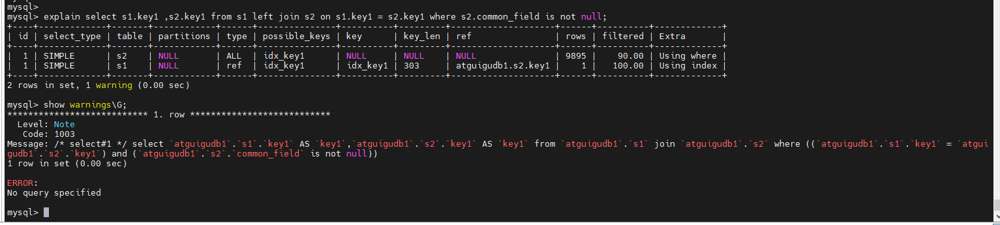

1.EXPLAIN的四种格式见,严格来说只有传统 json 和 tree三种, 可视化输出是需要通过 MySQL Workbench才可以查看到的;

2.关于warnings的使用,可以帮助我们查看优化器重写的SQL执行计划
    我们在服务器上执行一条sql语句以后,再执行命令show warnings;就可以看到上一条sql语句的优化后的真正的执行计划语句,可以帮助我们更好
  理解sql执行规则和explain输出语句信息;需要注意在idea连接mysql的terminal中执行是看不到的,必须要在服务器上运行;

3.Sys schema监控分析视图,相关介绍见