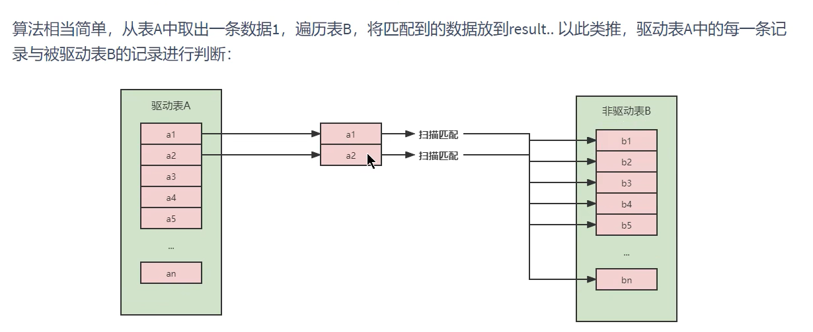
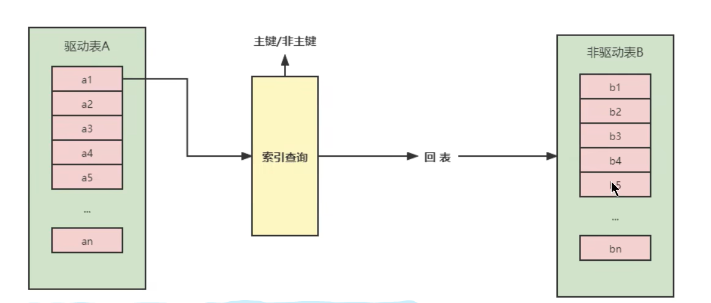

1.数据准备 

2.关联查询案例
    - 左外连接
        先说结论,左外连接会始终以左表作为驱动表,右表作为被驱动表;本质是因为,左外连接最终会保存全表数据,并外接符合条件的右表数据,
      所以对于左表来说一定是一个全表查询;全表查询一定是作为驱动表会相对好些;
        但是在测试时发现,上面的结论是错误的,左表也可能是被驱动表,因为优化器可能将我们的左外查询优化为内查询;
        因为无论是左外连接还是内连接的本质,都是小结果集驱动大结果集,因为索引的构建和数据量的差异,即使是左外连接,也可能出现左侧最终是
      被驱动表的可能性,本质还是要看哪种方式效率更高;  [演示案例](左外连接,右表驱动左表的案例.sql)
    - 内连接
        内连接的情况比较复杂,我们均以下面的同一条sql语句进行分析,区别在于有无索引,数量级的改变,但不会改变语句;
            select sql_no_cache * from book inner join type on book.card = type.card
        1)type,book的card字段均无索引,且两表的数量级相同;
            在我的测试过程中,发现跟写法有关,如果book写在inner之前,则book作为驱动表;如果type写在inner之前,则type作为驱动表;
          但其实这种情况并不是我们的学习重点,因为两个表都无索引,数量级也一致,其实谁作为驱动表和被驱动表的区别也不大,无需过多纠结,
          暂时就按照当前测试结果记录,会根据写法决定驱动表,前面的就是驱动表,后面的就是被驱动表;
        2)type,book的card字段均无索引,但type表的数据量大于book表;type,book的card字段均有索引,但type表的数据量大于book表;
            我认为这两种本质上是相似的,只不过有索引的情况比较好解释;
            驱动表需要全表查询,而被驱动表在有索引时实际上是一个等值查询,所以效率很高,那么此时驱动表的数量级越少,整体的查询次数也就越少,
          拿数据举例,此时一个表是20,一个表是30,反正都有索引,被驱动表是等值查询,那么20的表查询次数就是20*1,而30的表就是30*1,所以
          选择数量级较小的作为驱动表是更合理的方案即小表驱动大表
            无索引情况不太好解释,但也确实是会选用数量级更小的表作为驱动表;
        3)type表有索引,book表无索引,数量级一致;
            数量级一致时,有索引的表是被驱动表;所以book是驱动表,type是被驱动表;
        4)对上述第二种情况的补充,其实说数据量是不准确的,更准确的说法是结果集;小结果集驱动大结果集
            explain select sql_no_cache * from type inner join book on book.card = type.card where type.id<5
          解读一下上面的语句,type30数据,book20数据,但是最终的结果,会选择type作为驱动表,这是因为在语句最后的where条件会将type的结果集
        变成5个,而book的结果集是20个,自然是选择type作为驱动表;
        以上几种情况本质上是想表明在内查询时,小表驱动大表的意义和被驱动表中应用索引的重要性,并且要明白所谓小表驱动大表的本质是
      小结果集驱动大结果集;

3.join语句的底层原理
    第一种就是驱动表和被驱动表都没有索引的join查询,这种情况的效率是很低的,遍历驱动表后,还需要把数据拿到被驱动表中遍历匹配,整个过程中,
  读取记录数是a+a*b;比较次数是a*b; 图示: 
    第二种就是在被驱动表中增加索引,这样虽然驱动表仍需要全表遍历,但是到了被驱动表的查询部分可以利用索引实现100%的过滤效果,整个过程中,
  读取记录数最大是a+b;因为可能存在不存在的结果,索引查询查不到,也就不会读取,所以最大是a+b,最小是a;比较次数是a次,在老师的讲述文档中引入
  了B+树的高度来细致化计算比较次数,我觉得这个没必要,引入索引就相当于一次找到,a*1表达即可;  图示: 
    第三种块嵌套循环连接则是为了处理被驱动表数据没有索引时效率过低而提出的一种方案;
    最开始我们没有索引的比较过程是这样的:驱动表拿出一条数据,加载被驱动表全表,然后匹配;
    我们提出的块查询方案:一次性加载驱动表的多条数据到一个join buffer缓冲区中,然后加载被驱动表全表,然后在join buffer中遍历查询被驱动表
  的每一条记录,这样可以大量减少我们加载被驱动表造成的IO消耗,将多次比较合并成了一次,降低了被驱动表的访问频率,提升了效率;但是需要注意,在这种
  模式下,join buffer缓存的是select查询的所有列,即如果我们写的是select *,那么就会把这个表的每行数据的所有列都存在join buffer上,这样
  会造成的问题就是相对来说join buffer一次性读取的驱动表的行数会相应减少,也就是对驱动表的IO次数要增多,从这个角度可以帮助我们理解为什么在
  经常有人说不要写select *,而要明确你要查询的列名;不过第三种方案在mysql8.0.20版本已经被废弃,取而代之的是hash join;
    第四种hash join,替代第三种搞得更优方案;优化器使用较小的表在内存中建立散列表,然后扫描较大的表并探测散列表,找出与hash表匹配的行;
    整个的查询过程根据我的理解大概是这样的,首先会将小表加载入内存,并基于联查涉及到的列形成一个hash表,该hash表的键是涉及联查的列的组合,
  值则是小表的两个列的对应值的hash后的结果;然后逐行扫描被驱动表,匹配相同的hashvalue即是我们查找的数据;大概的思路应该是这样,其实跟之前
  用块的方式有些类似,都是一次取出驱动表的多条数据,然后遍历被驱动表来匹配,只不过我们创建hash表存入内存后,对于并发查询的效果会更好;其他方面
  我觉得感觉也差不太多,暂时先这些吧;