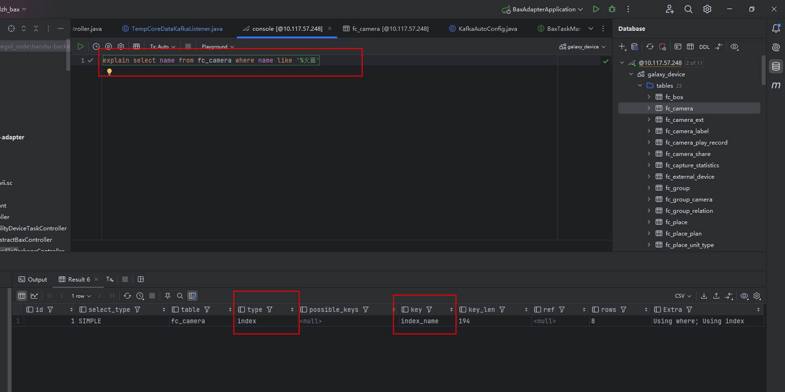

1.覆盖索引的概念
    项目内 检索 覆盖索引或者索引覆盖 查看即可;
    简单讲就是查询语句的结果可以直接由索引提供,而不需要进行回表查询;后续会详解
    但依照我个人有以下理解:
    首先简单的select price from students where price = 100;price本身是索引,而返回的内容也只需要price,这就时索引覆盖;
  若select name,price from students where price = 100,name是普通列,那么这种时候就需要回表再查name信息,并非索引覆盖;
  还有像上面我们那个例子,联合索引包含多个列,查询的结果恰好也是这几个列,所以也用到了索引覆盖;只不过根据最左前缀法则,我们会认为不会
  使用这个联合索引,但可能正是因为查询的结果列恰好就是联合索引中的列这一特性,才应用到了索引覆盖,使用了这个联合索引;
    
2.覆盖索引告诉我们什么？
    覆盖索引可以推翻我们之前的11种索引失效情况, 
    因为这些索引失效的情况本质上并不是索引无法使用了,而是优化器认为不使用索引的时候效率会更高,因此才会在explain输出语句中看起来索引失效
    11种索引失效的情况都会被索引覆盖所推翻,因为当出现覆盖索引的时候,优化器认为用索引就是最好最好的情况;

3.覆盖索引的优点
    避免了Innodb表进行索引的二次查询(回表)
    可以把随机IO变成顺序IO,加快查询速度:
        二级索引连续,但是回表查询时,可能多个页之间并非连续,就会变成随机IO,而不会回表就可以避免这种随机IO,因为二级索引本身是连续的,
      索引覆盖的情况下需要返回的数据都在这棵二级索引树上,所以字节返回就可,是顺序IO)

4.索引下推(ICP)
    索引下推是一种优化手段,它可以在联合索引失效的情况下,通过对索引进行判断,避免了无用的回表操作,减少了查询的IO操作次数,从而提高了查询效率;
    之前的笔记中其实也有记录过索引下推,但是不够准确,索引下推通常应用于联合索引中,假如我们此刻创建联合索引(a,b,c);
        select * from table where a=1 and b=2 and c>3   这种情况并不是索引下推,而是直接应用该联合索引进行查询
    那么什么时候才会出现索引下推呢?在联合索引中,需要有失效索引
        select * from table where a=1 and b!=2 and c=3  
    这种情况才是索引下推,区别在哪？区别就在于b用了!=,而!=会导致索引失效,也就是说在这种情况下,实际上联合索引只有a那列生效了,
  按理说现在a查完了,应该要回表了,这是索引下推就产生了效果,虽然索引无法生效来检索b,但是可以在此刻来进行判断,c也是同理,这样整个
  过程就是先用联合索引的a列对a进行了条件查询,然后利用索引下推的特性对b和c进行了判断,最后再回表,通过主键查到完整数据;那么在整个
  过程中,这个因为联合索引特性和索引失效共同导致的先判断后回表的动作,就是TMD索引下推;
    索引下推的开启和关闭
    开启: set optimizer_switch = 'index_condition_pushdown=on'
    关闭: set optimizer_switch = 'index_condition_pushdown=off'