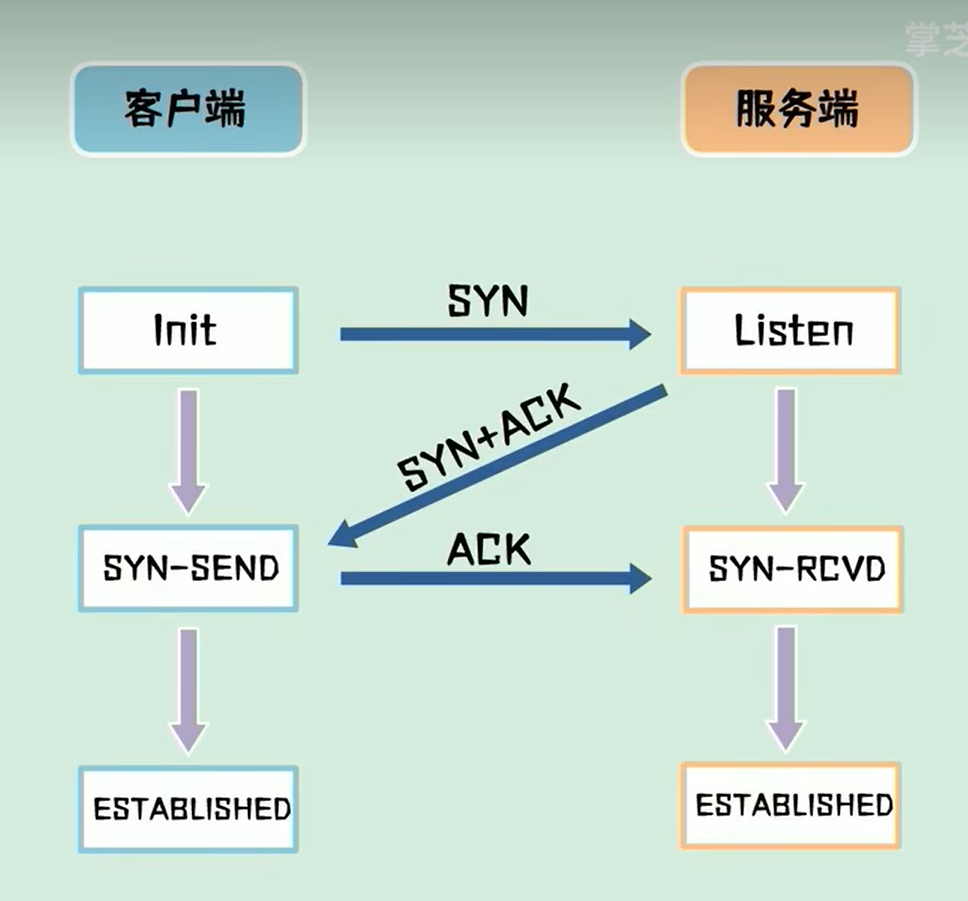
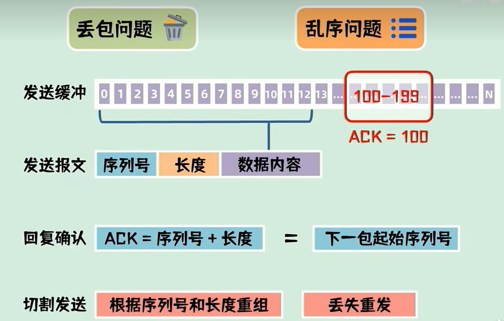
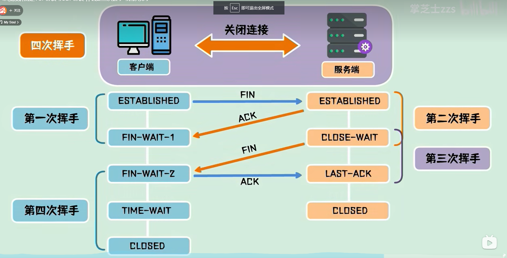

三次握手
    三次握手是建立连接的过程,当客户端向服务端发起连接时,
    会先发一包连接请求数据即SYN包,用于请求建立连接
    如果对端同意建立连接则回复一个SYN+ACK包
    客户端收到之后再发送一个ACK包
    至此,连接建立
    因为过程中互相发送了三次数据包,所以TCP建立连接的过程又称三次握手

为什么是三次握手而不是两次?
    是为了防止已失效的报文突然又传到服务器引起错误
    如果只有两次握手,假设客户端预先发送了一个SYN1给对端,但是因为网络问题,数据包无法抵达对端;
  为了建立连接,客户端再次发送一个数据包SYN2给对端,对端接收并返回一个SYN2+ACK1包之后建立连接,
  但是突然刚才阻塞SYN1的网络通畅了,SYN1到达对端,对端对此是没有感知的,以为客户端又要建立连接,
  就返回一个SYN1+ACK2包,认为又一次建立连接成功,并进入等待状态,此时服务端认为是两个连接,但是
  客户端认为只有一个连接, 两次握手就会造成这样的状态不一致;如果有三次握手,服务端迟迟没有收到客
  户端返回的ACK就不会认为连接成功进入等待状态,也就不会出现两端状态不一致的情况,才是我们想达到
  的理想情况;
    所以三次握手本质上来说,就是为了解决网络信道不可靠的问题;

经过三次握手后,两端都进入了数据传输状态,此时有几个问题需要面对,一包数据可能会被拆成多包发送,如何处理丢包问题?
这些数据包到达的先后顺序不同,如何处理乱序问题?
    针对这些要求,TCP协议为每一个连接建立了一个发送缓冲区,从建立后的第一个字节的序列号为0,后面每个字节的序列号都会+1,
  发送数据时,从发送缓冲区取一部分数据组成发送报文,在报文的协议头中会附带序列号和长度,接收端在收到数据后,需要回复确认
  报文,确认报文中的ACK等于接收序列号+长度,也就是下一包数据需要发送的起始序列号,这样一问一答的发送方式能够使发送端确认
  发送的数据已经被对方收到,发送端也可以一次发送连续的多包数据,接收端只需要回复一次ACK就可以了,这样发送端可以把待发送
  的数据分割成一系列的碎片发送到对端,对端根据序列号和长度在接收后重构出完整的数据
    假设其中丢失了某些数据包,在接收端可以要求发送端重传,比如丢失了100-199这100个字节,接收端向发送端发送ACK=100的报文,
  发送端就会在收到后重传这一包数据,接收端进行补齐;
    以上过程不区分客户端和服务端,TCP连接时全双工的,对于两段来说均采用上述机制

四次挥手
    处于连接状态的服务端和客户端都可以进行关闭连接请求,此时需要四次挥手来进行连接关闭
    客户端发起连接关闭请求,需要向服务端发送一包FIN包,自己则进入中止等待1状态 FIN-WAIT-1,这是第一次挥手
    服务端接收到FIN包,发送一包ACK包表示自己进入了关闭等待状态CLOSE-WAIT,这是第二次挥手 
    客户端接收到ACK包后进入中止等待2状态 FIN-WAIT-2
    服务端此时还可以发送未发送的数据,而客户端还可以接收数据,
    服务端发送完所有数据后,会发送一包FIN包并进入最后确认状态LAST-ACK,这是第三次挥手
    客户端收到FIN包之后会回复对端一个ACK包,并进入超时等待状态TIME-WAIT,客户端在经过超时时间后就会关闭连接,这是第四次挥手
    而服务端在收到FIN包后就会立刻关闭连接
    整个过程共计发送了四次数据包,所以也称断开连接的过程为四次挥手

为什么客户端需要等待超时时间后才会关闭连接?
    这是为了保证对方接收到ACK包,因为假设客户端发送完最后一个ACK包后立即释放连接,一旦ACK包在网络中丢失,服务端将一直停留在最后确认状态
  如果客户端发送最后一包ACK包后等待一段时间,这时服务端因为没有收到ACK包会重发FIN包,客户端呢也就会响应的响应这个新的FIN包,并且重发ACK包,
  同时刷新超时时间
