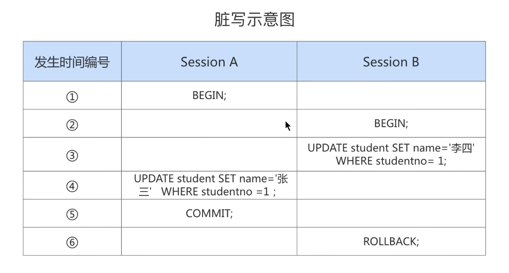
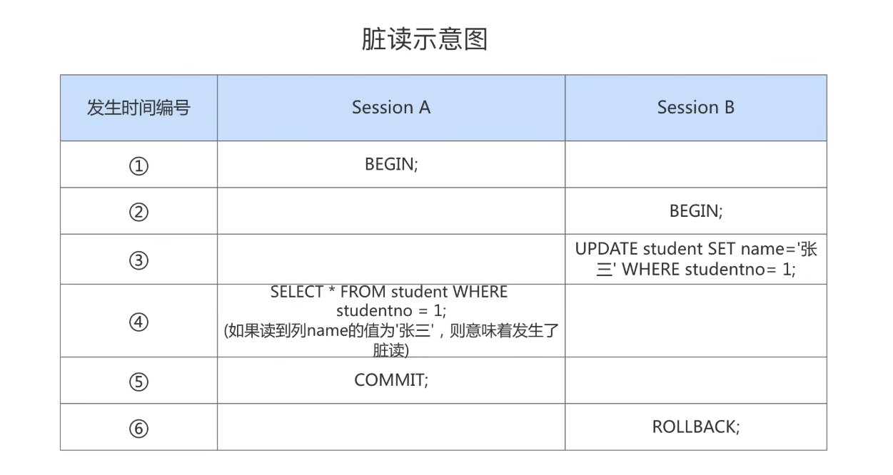
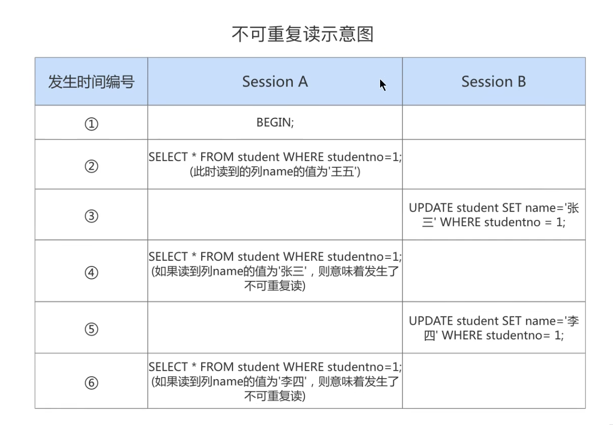

## 事务隔离级别
1.数据准备
　  CREATE TABLE student (
                         studentno INT,
                         name VARCHAR(20),
                         class varchar(20),
                         PRIMARY KEY (studentno)
    ) Engine=InnoDB CHARSET=utf8;
　 INSERT INTO student VALUES(1, '小谷', '1班');

2.数据并发问题
    1.脏写
      对于两个事务SessionA、SessionB,如果事务SessionA修改了另一个未提交事务SessionB修改过的数据,那就意味着发生了脏写,之后无论B回滚还是提交
    SessionA修改的内容都会被覆盖掉;
      
　
    2.脏读
      对于两个事务SessionA、SessionB,SessionA读取了已经被SessionB更新但还没有提交的字段,之后若B回滚,那么SessionA读取的内容就是临时且无效的;
    
　
    3.不可重复读
      对于两个事务SessionA、SessionB,SessionA读取了一个字段,然后SessionB更新了该字段,之后SessionA再次读取同一个字段,值就不同了,那就意味着
    不可重复读;
    
　
    4.幻读
      对于两个事务SessionA、SessionB,SessionA从一个表中读取了一个字段,然后SessionB在该表中插入了一些新的行,之后,如果SessionA在读取同一个表,
    就会多出几行,那就意味着发生了幻读;
      上面这个解释我觉得不是很容易理解,下面是一个我个人觉得更容易理解的说法:
      一个事务按照条件查询数据时,没有对应的数据行,但是在插入数据时,又发现这行数据已经存在,好像出现了幻觉;
      需要注意:幻读强调的是读取到了之前没有读取到的记录,比如我刚开始读取到了三条记录,第二次读取发现只有一条记录了,这并不属于幻读;
　
3.SQL中的隔离级别
    上面介绍了几种并发事务执行过程中可能遇到的一些问题,这些问题有轻重缓急之分,我们按照问题严重性进行排序的话应是:
        脏写 > 脏读 > 不可重复读 > 幻读
    我们愿意舍弃一部分隔离性来换取一部分性能在这里就体现在: 设立一些隔离级别,隔离级别越低,并发问题发生的就越多,SQL标准中设立了4个隔离级别:
    - READ UNCOMMITED 读未提交   无法避免脏读、不可重复读、幻读
    - READ COMMITED 读提交     解决了脏读,无法避免不可重复读、幻读
    - REPEATABLE READ 可重复读  解决了脏读、不可重复读,无法避免幻读
    - SERIALIZABLE 串行化      解决了脏读、不可重复读和幻读
    上述四个隔离级别都解决了脏写的问题;
    剖析四种隔离级别:
      读未提交是最低的隔离级别,虽然各个事务可以看到彼此的未提交的数据,但它们的修改依然可能出现冲突和覆盖;
      读提交可以有效的解决脏读的问题,因为只有已提交事务才能被彼此看到,就避免了脏读发生的本质情况(读取到了其他事务未提交的更改)
      读提交无法避免不可重复读,因为依然存在我第一次和第二次读取之间,有其他事务修改了数据;
      可重复度解决了重复读的问题,可重复度可以保证一个事务开始后,他所读取的数据保持一致性,即使其他事务对数据进行了修改,对于当前事务仍是不可见的,
    这也可以说明为什么可重复度无法解决幻读的问题,很明显这里存在一种可能,别人新增了数据,但是当前事务并不知道,然后也新增了相同主键的数据,那最后
    commit的时候肯定是无法ok的,也就是幻读;
      串行化是如何解决幻读的呢?举例说明,假如事务一:select * from table where id = 2;,那么此刻id=2这条记录就被锁住了,除了在当前事务中可以
    对该行进行操作,其他任何事务此刻如果试图对这行数据进行操作,都会被阻塞,直到原事务操作完毕后,才能继续,这样对于其他事务来说,实际上根本无法获悉
    id=2的数据是否存在,也就没法贸然添加,即使直接添加,也是无法添加,但起码对于其他事务来说,没有出现查的时候没有,插入的时候才有问题的幻读情况;

4.Mysql的隔离级别
    Mysql支持上述四种隔离级别,默认的隔离级别是可重复读
    命令查看mysql当前隔离级别: mysql> show variables like 'transaction_isolation';
    
    