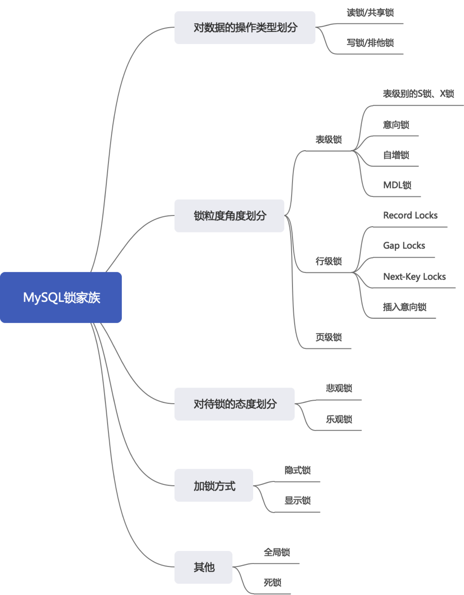

1.从数据操作的类型划分: 共享锁、排他锁
    在使用加锁的方式解决并发问题时,由于既要允许读-读情况不受影响,又要使写-写、读-写或写-读情况下的操作互相阻塞,所以MYSQL实现一个由两种类型的锁组成的锁系统来解决;
    这两种类型的锁通常被称为共享锁(Share Lock,S锁)和排他锁(Exclusive Lock,X Lock),也叫读锁和写锁;
      - 读锁:也称为共享锁,S锁;针对同一份数据,多个事务的读操作可以同时进行而不会互相影响;
      - 写锁:也称为排他锁,X锁;表示当前写操作没有完成前,它会阻断其他写锁和读锁,这样就能确保在给定的时间里,只有一个事务能执行写入,并防止其他事务读取正在写入的同一资源;
    需要注意的是对于InnoDB来说,读锁和写锁可以加在表上,也可以加在行上;
    这里用一个行级读写锁进行举例帮助理解:
        如果一个事务T1已经获得了某个行r的读锁,那么此时另外的一个事务T2是可以去获得这个行r的读锁的,因为读取操作并没有改变行r的数据;但是如果某个事务T3想要获取行r的写锁,
      那么T3必须等待事务T1、T2释放掉行r上的读锁才行;
    我们应明确一点即共享锁和排他锁才是我们学习的核心概念,写锁确实是排他的,但是读锁并不都是共享的,读锁也可以具有排他性;

2.锁定读的语法演示
    对读取记录加S锁
      - SELECT ... LOCK IN SHARE MODE;
      - SELECT ... FOR SHARE; (MYSQL8.0新增语法)
　
    对读取记录加X锁
      - SELECT ... FOR UPDATE;
　
    在5.7及之前的版本,如果获取不到锁会一直等待,直到innodb_lock_wait_timeout超时,在8.0版本中,可以通过添加后缀来跳过锁等待或者跳过锁定;
      - SELECT ... FOR SHARE NOWAIT;    如果查询的数据已经加锁,那么NOWAIT会立即报错返回
      - SELECT ... FOR SHARE SKIP LOCKED;   如果查询的数据已经加锁,那么SKIP LOCKED也会立即返回,只是返回的结果中不包含被锁定的行;
　
3.写操作
    DELETE:
        对一条记录做DELETE操作的过程就是先在B+树中定位到这条记录的位置,然后获取这条记录的X锁,再执行delete mark操作,我们可以把定位待删除记录在B+树
      中位置的过程看成一个获取X锁的锁定读;
    UPDATE: 在对一条记录做update操作时分为三种情况
        情况1:未修改该记录的键值,并且被更新的列占用的存储空间在修改前后未发送变化,则在B+树中定位到这条记录的位置,然后再获取一下记录的X锁,最后在原记录
             的位置进行修改操作,我们也可以把这个定位待修改记在B+树中位置的过程看做是一个获取X锁的锁定读;
        情况2:未修改该记录的键值,并且至少有一个被更新的列占用的存储空间在修改前后发生变化,则先在B+树中定位到这条记录的位置,然后获取一下记录的X锁,之后
             将记录彻底删除掉(就是将记录移入垃圾链表),最后再插入一条新纪录;这个定位待修改记录在B+树中位置的过程看成是一个获取X锁的锁定读,新插入的记录
             由INSERT操作提供的隐式锁进行保护;
        情况3:修改了该记录的键值,则相当于在原记录上做DELETE操作之后再来一次INSERT操作,加锁操作就需要按照DELETE和INSERT的规则进行了;
    INSERT: 一般情况下,新插入一条记录的操作并不加锁,通过一种称之为隐式锁的结构来保护这条新插入的记录在事务提交前不被别的事务访问;    
    小结: UPDATE和DELETE是真正的加了X锁,而insert操作由于还没生成真实数据,所以无法加锁,只能用隐式锁的形式来保证insert操作提交前不被其他事务访问;