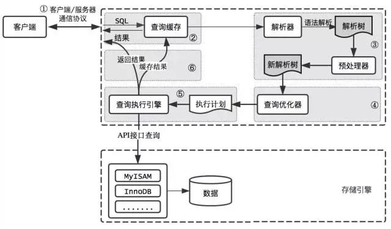
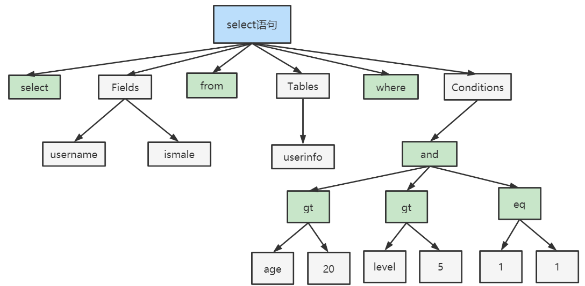

图示:

1.查询缓存
    Server如果在查询缓存中发现了这条SQL语句,就会直接将结果返回给客户端;如果没有,就进入到解析器阶段;
  需要说明的是,因为查询缓存往往效率不高,所以在MySQL8.0开始抛弃了这个功能;
    之前我们有提到过,查询缓存中保存数据是key、value的形式,key就是查询语句,value则是查询结果;

  为什么废弃查询缓存?
    之所以废弃,之所以效率不高本质上是因为缓存的命中率太低了,两个查询请求在任何字符上的不同,例如:空格、注释、大小写,都会导致缓存无法命中,
  也因此查询缓存命中率不高;
    并且如果查询请求中包含某些系统函数还会出现更大的问题,比如在一个查询请求中调用了时间函数now(),那么,不同时间的
  两次调用语句虽然是完全一样的,但是结果理应是不同的结果,可是因为第一次查询结果被缓存,就会导致第二次查询直接命中缓存,进而两次结果相同,但是
  我们都知道第二次结果是错误的!
    此外既然是缓存,那就有缓存失效的时候;MYSQL的缓存系统会监测涉及到的每张表,只要该表的结构或者数据被修改,那么使用该表的所有缓存都会失效,
  那么对于更新压力较大的数据库来说,查询缓存的命中率会非常低;
    基于以上几点,在MYSQL8.0开始废弃了这个功能;

2.解析器
    在解析器中对SQL语句进行语法分析、语义分析
    这里一个是对SQL语法进行判别,一旦你语法出现问题,就会报错,向我们在编写错误的sql语句并执行后的报错就是在解析器中产生的;
    如果SQL语句正确,则会生成一个语法树,类似:

3.优化器
    在优化器中会确定SQL语句的执行路径,比如是根据全表检索还是根据索引检索
    一条查询可以有很多种执行方式,最后都返回相同的结果;优化器的作用就是找到这其中最好的执行计划
    在查询优化器中可以分为逻辑查询和物理查询两个优化阶段;
    简单理解一下两种优化
    - 逻辑查询优化就是通过SQL等价变换提升查询效率,直白一点说就是换一种写法执行效率可能更高
    - 物理查询优化就是通过索引和表连接方式等技术来进行优化,这里的重点是索引;

    注:优化器部分会在后续索引部分详述,此处大概了解即可

4.执行器
    在优化器阶段会最终生成一个最好的执行计划,而这个执行计划的实施就是由执行器来负责;
    执行器调用存储引擎API对表进行读写

    终:最终的执行流程即
    sql语句 ——> 分析器(进行语法分析、语义检查) ——> 生成一个语法分析树 ——> 优化器(逻辑优化、物理优化) ——> 根据语法分析书选出最优执行计划 ——> 执行器