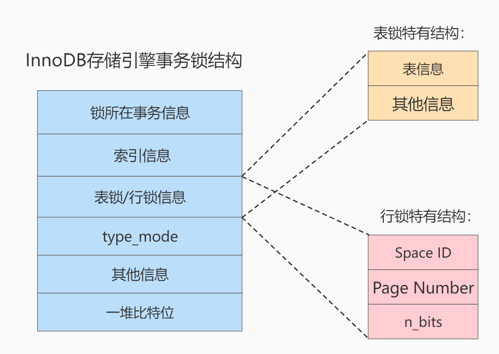

InnoDB中存储引擎的锁结构介绍

1.锁所在的事务信息
    不论是表锁还是行锁,都是在事务执行过程中生成的,哪个事务生成了这个锁结构,这里就记录一个指向该事务信息的指针,可以通过指针找到完整的事务信息

2.索引信息
    对于行锁来说,需要记录一下加锁的记录是属于哪个索引的,这里也是记录了一个指针;

3.表锁/行锁信息
    表锁结构和行锁结构在这个位置的内容是不同的:
      - 表锁:记载着是对哪个表加的锁
      - 行锁:记载了三个重要信息: 
          Space ID: 记录所在表空间
          Page Number: 记录所在页号
          n_bits: 对于行锁来说,一条记录就对应着一个比特位,一个页面中包含很多条记录,我们需要用不同的比特位来区分哪一条记录加了锁,为此在行锁结构的末尾
                  位置放置了一堆比特位,这个n_bits属性代表使用了多少比特位(即多少条记录加锁,n_bits的值一般都比页面中记录的条数多一些,主要是为了之后
                  在页面中插入新纪录后也不至于重新分配锁结构);

4.type_mode:
    这是一个32位的数字,被分为lock_mode、lock_type和rec_lock_type三个部分
    lock_mode: 锁模式,占用低4位,
      - LOCK_IS (十进制的0): 表示共享意向锁,也就是IS锁
      - LOCK_IX (十进制的1): 表示独占意向锁,也就是IX锁 
      - LOCK_S (十进制的2): 表示共享锁,也就是S锁 
      - LOCK_X (十进制的3): 表示独占锁,也就是X锁 
      - LOCK_AUTO_INC (十进制的4): 表示AUTO-INC锁 
　
    lock_type: 锁类型,占用5~8位,不过现阶段只有第5位和第6位被使用
      - LOCK_TABLE (十进制的16),也就是当第5个比特位置为1时,表示表级锁
      - LOCK_REC (十进制的32),也就是当第6个比特位置为1时,表示行级锁
　
    rec_lock_type: 行锁的具体类型,使用其余的位来进行表示,只有在lock_type=LOCK_REC时,才会被进一步细分
      - LOCK_ORDINARY (十进制的0): 表示next-key锁(临键锁)
      - LOCK_GAP (十进制的512): 也就是当第10个比特位置为1时,表示gap锁(间隙锁)
      - LOCK_REC_NOT_GAP (十进制的1024): 也就是当第11个比特位置为1时,表示正经记录锁
      - LOCK_INSERT_INTENTION (十进制的2048): 也就是当第12个比特位置为1时,表示插入意向锁
      - 其他的类型: 还有一些不常用的类型我们就不多说了
      - LOCK_WAIT (十进制的256): 基于内存空间的节省,所以把is_waiting 属性放到了type_mode这个32位的数字中,当第9个比特位置为1时,表示is_waiting 为true,
                                也就是当前事务尚未获取到锁,处在等待状态;当这个比特位为0时,表示is_waiting为false,也就是当前事务获取锁成功;

5.其他信息
    为了更好的管理系统运行过程中生成的各种锁结构而设计了各种哈希表和链表;

6.一堆比特位
    每一个比特位都对应着该页中的某一条记录,一个比特位会映射一条记录的heap_no(表示当前记录在本页中的位置),在这里被映射到的记录实际上就是被锁住的记录;
    

疑问点:InnoDB中给一些记录加了行锁%2C之后会在内存中生成一个行锁记录用于记录信息，我的疑问是如果之后我释放了锁,
      那么锁结构会消失吗下次我又要加锁是会用之前的锁结构还是会重新构建一个锁结构呢
      锁结构是否是始终存在的,只是在我们对一些记录加锁后,会在锁结构中记录相关的记录信息和事务信息