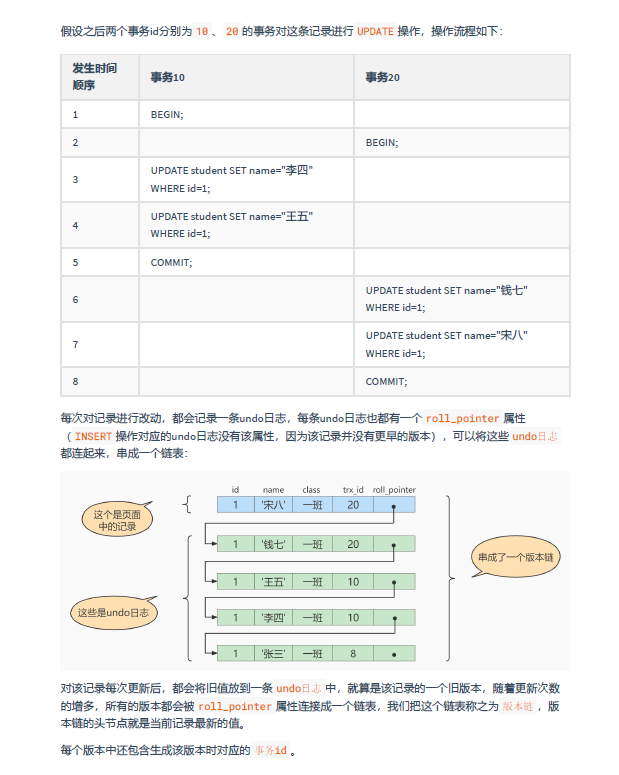

1.什么是MVCC
    多版本并发控制,MVCC是通过数据行的多个版本管理来实现数据库的并发控制,MVCC使得在InnoDB事务隔离级别下执行一致性读操作有了保证,换言之,就是为了
  查询一些正在被另一个事务更新的行,并且可以看到它们被更新之前的值,这样在做查询的时候就不用等待另一个事务释放锁;

2.快照读和当前读
    MVCC在InnoDB中的实现主要是为了提高数据库并发性能,用更好的方式去处理读写冲突,做到即使有读写冲突时,也能做到不加锁,非阻塞并发读,这里并发读的读
  指的就是快照读而非当前读;
    当前读实际上是一种加锁的操作,是悲观锁的体现,而MVCC本质是采用乐观锁思想的一种方式;
　
    - 快照读
        快照读又叫一致性读,读取的是快照数据,不加锁的简单的select都属于快照读,即不加锁的非阻塞读
        之所以出现快照读的情况,是基于提高并发性能的考虑,快照读的实现是基于MVCC,MVCC在很多情况下,避免了加锁操作,降低了开销;既然是基于多版本,那么
      快照读读到的可能并不一定是数据的最新版本,而有可能是之前的历史版本;其实就是ReadView
        快照读的前提是隔离级别不是串行级别,串行级别下的快照读会退化为当前读
    - 当前读   
        当前读读取的是记录的最新版本(最新数据,而不是历史版本的数据),读取时还要保证其他并发事务不能修改当前记录,会对读取的记录进行加锁;即加锁的select,
      或者对数据进行增删改都会进行当前读

3.undo log版本链的形成

4.什么是ReadView
    MVCC的实现依赖于: 隐藏字段(trx_id、roll_pointer)、Undo Log、Read View
    在MVCC中,ReadView是一个用于读取操作的快照视图,每个事务在开始时都会创建一个自己的ReadView,该视图用于确定在该事务开始之前提交的所有事务的可见数据版本,
  用人话说就是ReadView决定了事务在执行读取操作时所能看到的数据版本,并通过记录已提交事务的ID(或时间戳)来实现并发控制;
    ReadView的一个重要特性是它是在事务开始时创建并保持不变的,这意味着在事务执行期间其他事务对数据库做出的更改不会影响到该事务的ReadView,这种设计确保了事务
  在整个执行过程中看到一致的数据库状态,从而保证了数据一致性;
    并且需要清楚,只有在增删改数据时系统会分配非0的事务ID给事务,而查操作时,事务id为0;

5.ReadView中包含四个比较重要的内容
    - creator_trx_id     创建这个ReadView的事务ID
    - trx_ids            表示在生成ReadView时当前系统中活跃的读写事务的事务id列表
    - up_limit_id        活跃事务中的最小事务ID
    - low_limit_id       表示生成ReadView时系统中应该分配给下一个事务的id值,low_limit_id是系统最大的事务id值,
                       这里要注意是系统中的事务id,需要区别于正在活跃的事务id
　
    注意:low_limit_id并不是trx_ids中的最大值,事务id是递增分配的,比如,现在有id为1,2,3这三个事务,之后id为3的事务提交了;那么一个新的读事务再生成ReadView时,
        trx_ids就包括1和2,up_limit_id的值就是1,low_limit_id的值就是4

6.ReadView的规则
    依赖ReadView,在访问某条记录时,只需要按照下边的步骤判断记录的某个版本是否可见 
      - 如果被访问的版本的行记录的trx_id值与ReadView中的creator_trx_id相同,意味着当前事务在访问自己修改过的记录,所以该版本可以被当前事务访问;
      - 如果被访问的版本的行记录的trx_id值小于ReadView中的up_limit_id,表明生成该版本的事务在当前事务生成ReadView前已经提交,所以该版本可以被
        当前事务访问
      - 如果被访问的版本的行记录的trx_id值大于或等于ReadView中的low_limit_id,表示生成该版本的事务在当前事务生成ReadView后才开启,所以该版本
        不可以被当前事务访问
      - 如果被访问的版本的行记录的trx_id值在ReadView的up_limit_id和low_limit_id之间,那么就需要判断一下trx_id的值是否在trx_ids列表中,
        如果在,说明创建ReadView时生成该版本的事务还是活跃的,该版本不可以被当前事务访问
        如果不在,说明创建ReadView时生成该版本的事务已经被提交,该版本可以被当前事务访问
    
7.MVCC的操作流程
    1)获取当前事务的事务id
    2)获取当前事务的ReadView
    3)获取数据的行记录中的trx_id,与当前事务的ReadView按照规则进行比较
    4)如果不符合ReadView规则,就说明当前版本的数据对当前事务不可见,那就顺着undolog版本链找到上一个版本的数据,继续根据trx_id和ReadView进行判断
    5)若符合就返回对应行数据;若某行数据直到版本链中最早版本经判断依然不可见的话,意味着该条记录对当前事务不可见,也就不会返回该行数据;
    具体的操作流程演示可见PDF[具体演示流程: 5.举例说明,5.1&5.2的内容](/pdf/第16章_多版本并发控制.pdf)

8.在不同隔离级别下生成ReadView的规则
    在隔离级别为读已提交时,一个事务中的每一次select查询都会重新获取一次ReadView
    在隔离级别为可重复读时,一个事务在执行过程中只会在第一次select查询时获取一次ReadView,之后的select都会复用这个ReadView
    
9.MVCC无法解决幻读问题
    MVCC只能够解决不可重复读的问题,而幻读的问题只能够通过间隙锁或者临键锁来解决;