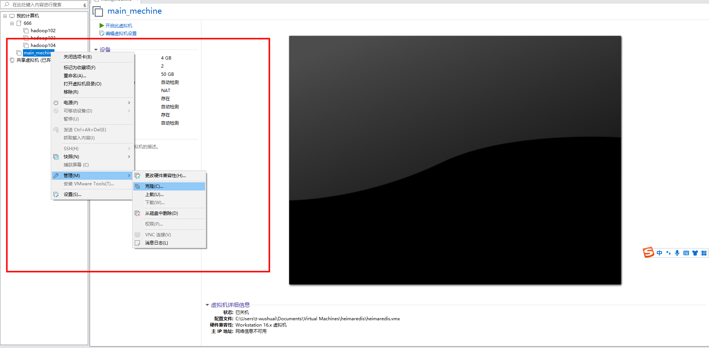
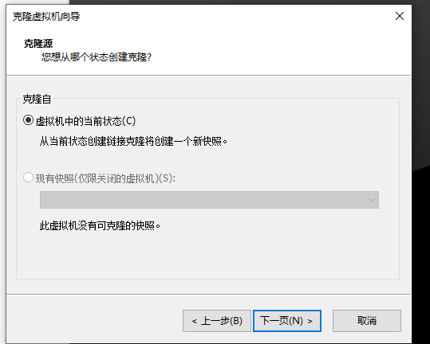
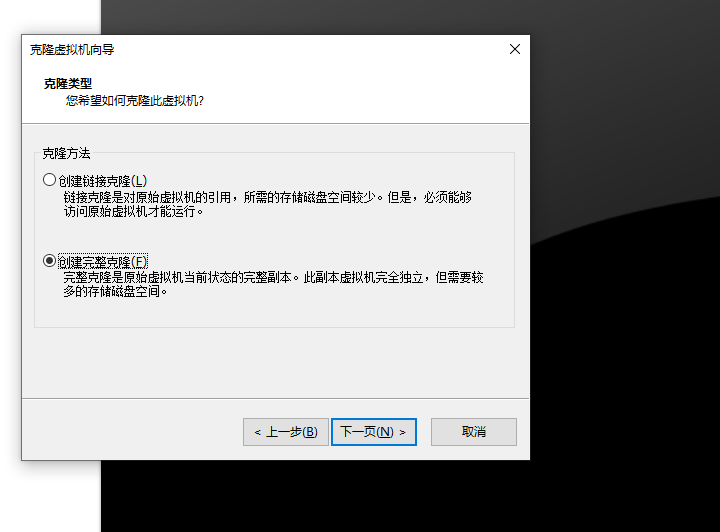
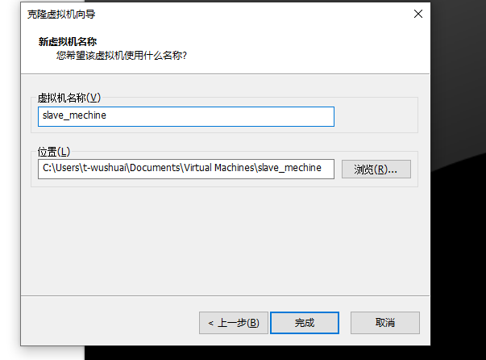

这就OK啦

虚拟机克隆完毕之后有几个需要修改的点,分别是:MAC地址、主机名、ip地址、UUID
- MAC地址现在克隆完毕后就已经不一样了,所以不需要进行更改,如果发现一样;需要在 网络适配器的高级中重新生成MAC地址 
- 主机名通过 vim /etc/hostname 使用root用户进行修改,修改后需要重启,重启命令:reboot;
- ip和UUID都是通过 vim /etc/sysconfig/network-scripts/ifcfg-ens33 进行修改 不过目前默认情况两台虚拟机的ip已经是不同的 所以我这里只修改了UUID
- 都修改完以后 systemctl restart network