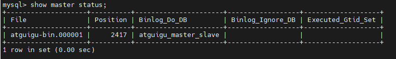

# 前期准备工作
在进行虚拟机克隆后我们还有一件事需要做,之前我们已经在一台机器上装了mysql,现在进行克隆后,mysql server的UUID是相同的,这会影响我们后续的主从复制,
所以需要修改,vim /var/lib/mysql/auto.cnf, 通过这个命令将两台机器的UUID进行区别;修改后需要重启mysql服务:systemctl restart mysqld;

# 注意
先搭建主从复制,再创建数据库;
Mysql主从复制起始时,从机不继承主机数据
因为如果我们在主机先创建了一个从机没有的数据库,那么之后我们在主机中对这个数据库进行增删改查,命令都记录在binlog中,然后从机去获取
主机binlog的内容并开始执行时会发现,我们都没有这个库啊,那这个数据同步肯定是失败的,所以若想实现主从复制的数据一致性,就需要在我们
基本的主从复制的配置都搭建好以后,再创建数据库;

# 一主一从架构搭建实操
整体流程及过程中可能出现的一些报错可见PDF,我们这里记录的是我们在自己本地进行正确搭建的流程

操作完第一步需要重启mysql服务: systemctl restart mysqld

第三步: 主机从机都需要关闭防火墙
    service iptables stop   #CentOS 6
    systemctl stop firewalld.service    #CentOS 7
    执行后可以通过 systemctl status firewalld  查询防火墙状态;

这里的show master status是一个MYSQL命令,用于查看当前主服务器上二进制日志的状态信息,
file表示当前正在写入的二进制日志文件名
position表示当前正在写入的二进制日志文件的位置(偏移量)

第六步:在从机中配置主从复制的信息
命令:
mysql> CHANGE MASTER TO MASTER_HOST='192.168.10.128',MASTER_USER='slave1',MASTER_PASSWORD='1234567a',MASTER_LOG_FILE='atguigu-bin.000001',MASTER_LOG_POS=2417;

MASTER_HOST:主机ip
MASTER_USER:数据同步用户名
MASTER_PASSWORD:数据同步用户密码
MASTER_LOG_FILE:要复制的binlog名
MASTER_LOG_POS:binlog中要开始进行复制的偏移量

第七步:在从机中开启主从同步
命令: mysql> start slave;

通过命令 SHOW SLAVE STATUS\G;   查看同步状态
我们这里重点观察的是
    Slave_IO_Running: Yes
    Slave_SQL_Running: Yes
二者都为Yes表示主从同步已经开启;
　
  完成,这里与我们之前docker上配置主从同步的步骤基本一致,不过我们这里在第一步的配置中指定要了进行主从复制的数据库名,所以只有该库(atguigu_master_slave)下的数据才会进行主从复制,
如果我们希望所有库都可以复制,不加上那一行配置即可;