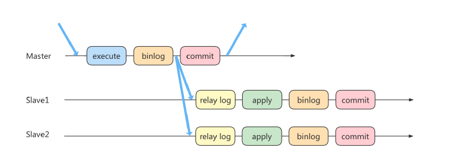
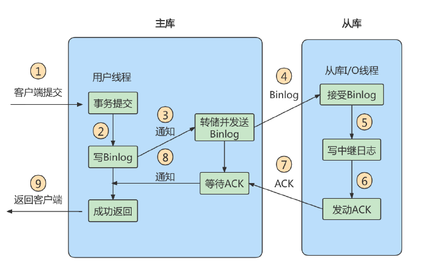

1.首先我们要清楚我们这里要介绍的场景,主从同步+读写分离,我们要解决的一致性问题也是针对该场景;

2.理解主从延迟问题(网络问题+从机接收完binlog和执行完这个事务之间的时间差)
    1)进行主从同步的内容是binlog即二进制日志文件,它是一个文件,则在网络传输的过程中就一定会存在主从延迟(比如500ms),
  这样就可能造成用户在从库上读取的数据不是最新的数据,也就是主从同步中的数据不一致性问题;
    2)除去网络传输造成的时间损耗外,主从延迟的主要成因是从机接收完binlog和执行完这个事务之间的时间差;关于这点我们举例说明,
  如果我们现在的场景是一次性用insert插入1000w条数据,那么在主机进行这个事务到最终生成binlog的时间大概是10分钟,ok,那我们
  忽略网络造成的时间损耗,从机将这些binlog执行也至少要10分钟的时间,那在此期间,其实主从节点的数据一致性就出现了问题;

3.如何解决主从延迟问题(优化代码+提升硬件)
    1)降低多线程大事务并发的概率,优化业务逻辑
    2)优化SQL,避免慢SQL,减少批量操作
    3)提高从库机器配置,减少主库写binlog和从库读binlog的效率差;
    4)尽量采用短的链路,也就是主从服务器之间的距离尽量短一些;提升接口带宽,减少binlog传输的网络延时
    5)对于有实时性要求的业务读,强制其走主库,从库只做灾备,备份;

4.如何解决读写分离情况下的一致性的问题
    读写分离情况下,解决主从同步中数据不一致的问题,就是解决主从之间数据复制方式的问题,如果按照数据一致性从弱到强来进行划分,
  有以下三种复制方式:
    - 
      异步复制模式就是指客户端提交commit之后不需要等待从库返回任何结果,而是直接将结果返回给客户端,这样做的好处是不会影响
    主库写的效率,坏处就是数据一致性比较弱;
      如图所示,在主库binlog刷盘后,进行二阶段的提交状态commit,在下一个瞬间,主库commit结束,而从库则还在将主库的binlog
    数据导入自己的redolog,那么从此刻开始计时,直到从库最终将事务提交的这个时间段里,实际上主从数据是不一致的;
      还有一种更极端些的场景,即 主库commit后,宕机了,此时binlog一定是没有完全同步到从库的,那么这种情况主从也是不一致的,
    并且如果此时在从库中选择一个作为新主,那么新主中还缺少了原来主服务器中已经提交的事务,这种场景造成的数据不一致更加不能接受;
      这种复制模式下的数据一致性是最弱的;
　    
    - 
      半同步复制原理是在主库commit之后不直接将结果返回给客户端,而是等待至少有一个从库完成了接收binlog,写入relaylog并执行
    事务这个过程后,再将结果返回给客户端;
      这样做的好处就是相比于异步复制来说,提高了数据的一致性,但是至少多增加了一个网络连接的延迟,降低了主库写的效率;
      不过如果是一主多从的集群模式,半同步复制同样存在主机宕机后,部分未进行ralaylog复制的节点出现数据不一致的情况,但至少我们
    可以确保一定有一组主从节点是完全一致的;
      Mysql5.7版本以后,增加了一个参数: rpl_semi_sync_master_wait_for_slave_count,该参数用于对应答数据库的数量进行  
    设置,默认为1,也就是说只要有一个从库完成了接收binlog,写入relaylog并执行事务这个过程后,主库就可以将结果返回给客户端,如果
    将这个参数调大,可以进一步提升数据一致性的强度,但也同样增加了主库等待从库响应的时间;
　
    -组复制
      这里老师也没用过多进行介绍,所以我们也只记录原理,有个印象即可;
      类似于zookeeper中的选举机制,我们的会先把集群中所有的节点看做一个整体,即一个组,对于读事务,我们不需要判断,直接同意,但是
    对于写操作,必须要有(大于 N/2 + 1)的节点完成在自己节点上的提交,才会最终将结果返回给客户端,需要注意的是在zk中选举是过半
    即大于N/2即可,但是这里老师的ppt中表示对于组复制来说必须要大于n/2+1才可以,这一点需要留意;